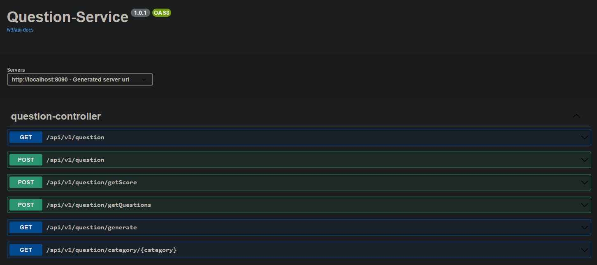
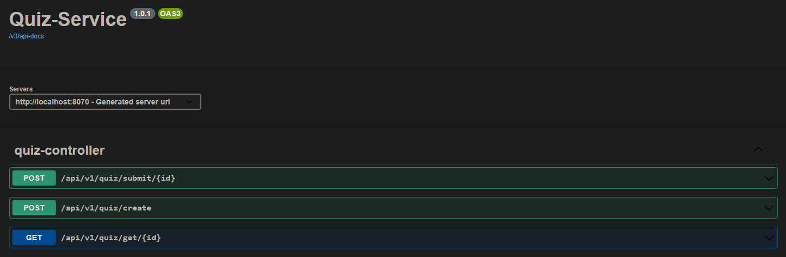

# Microservice Quiz App

Welcome to the Microservice Quiz App! This project represents my initial exploration into building a microservices architecture, aimed at creating a dynamic and efficient quiz application. As a test project, it incorporates various technologies and tools to enhance development, containerization, and more. This marks my first endeavor into the world of microservices, and I'm excited to share my progress and learning journey with you.

## Features

 - API Gateway Service: The API Gateway acts as a single entry point for all client requests, 
 routing them to the appropriate microservices. This enhances security and simplifies client-server communication.


- Registry Service with Eureka: The Registry Service uses Eureka for service registration and
  discovery. This aids in maintaining a robust and dynamic microservices ecosystem.


 - Question Service: This service handles the storage and retrieval of questions for quizzes. 
 PostgreSQL is used as the database for seamless data storage, ensuring reliable and efficient data handling.


 - Quiz Service: The Quiz Service manages the creation, modification, and retrieval of quizzes. It 
interacts with the Question Service to provide a complete quiz experience.


 - Containerization: Docker is utilized for containerization, simplifying deployment and scalability of microservices.


## Docker-compose Setup and Starting

To run the application using Docker Compose, please follow these steps:

1. Make sure you have Docker and Docker Compose installed on your machine. If not, please refer to the Docker documentation for installation instructions specific to your operating system.

```sh
  docker-compose -v
```

2. Clone the repository to your local machine:

```sh
  git clone git@github.com:uch2ha/Microservice-Quiz-App.git
```

3. Navigate to the project directory:

```sh
  cd Microservice-Quiz-App
```

4. Build and start the application containers using Docker Compose. This command will build the 
necessary Docker images and start the application containers in the background.

```sh
  docker-compose up -d
```

5. Once the containers are up and running, you can access the app using the following URLs:

- Eureka URL (Service Registry):
  Open your web browser and navigate to http://localhost:8761. Here, you can view and manage the registered microservices.


 - Main URL (API Gateway):
 Use Postman or a similar API testing tool to navigate to http://localhost:8080. This is the main entry point to access all app functionalities.


 - Question Service URL:
The Question Service, responsible for managing questions, can be accessed at http://localhost:8090.


 - Quiz Service URL:
The Quiz Service, responsible for quizzes, can be accessed at http://localhost:8070.


## REST API Endpoints

All available routes:


 


 


### Note: To interact with these endpoints, make requests to API Gateway at http://localhost:8080
